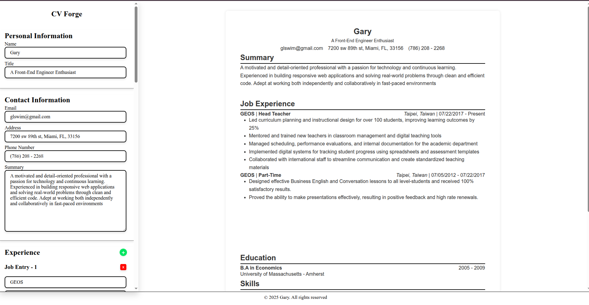

## 📸 Preview

## 📝 About

CV Forge lets users input personal, experience, education, skills, and languages to generate a live preview of their CV. It’s built with pure JS, CSS, and HTML—no React, Tailwind, or other frameworks.

## 🚀 Features

- Dynamic form inputs for sections like Experience, Education, Skills, and Languages
- Live preview updates as you type
- Add/remove form sections on-the-fly
- Date inputs handled with custom vanilla JS formatting

## 💾 Usage

1. Clone the repo
2. Open `index.html` in your browser
3. Start typing into the form and watch the live preview!

## 📝 License

MIT © 2025 Gary Lei
